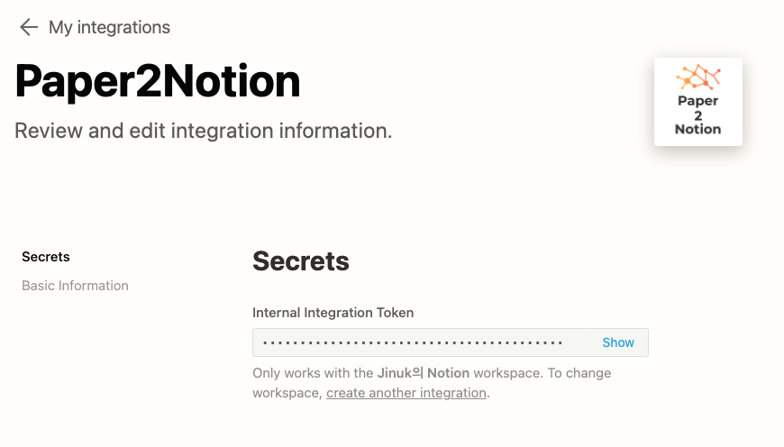
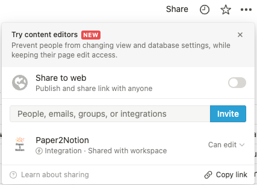
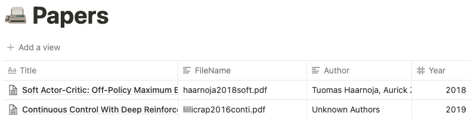

# paper2notion

## Summary


## Preliminary
-  **Notion Token id** : Since this repository utilize the [*official notion sdk*](https://github.com/ramnes/notion-sdk-py), you should make use of notion token from your own notion integration.
    1. Visit [my-integrations](https://www.notion.so/my-integrations) page.
    2. Make new internal integration connected to your workspace (name doesn't matter).
    3. Find your Notion Token id from integration setting.
    

-  **Notion Database** : Now create your own Notion Database in your workspace.
    - You can find your Database id in your url : `https://www.notion.so/jusjinuk/{your_database_id}`
    - You should share your database with integration you made above. `Share` button can be found in top-right corner.
        
        
    - Your Database should have `Title`, `FileName`, `Author` and `Year` column. Each column should match following properties:
        - `Title` : `Title`
        - `FileName` : `Text`
        - `Author` : `Text`
        - `Year` : `Number`

        

## How to Use

1. Clone this repository and install packages in `requirements.txt`.
2. Add following `run.py` file filled with your own Notion Token id, Notion Database id, and PDF file(or directory) path at root directory.
    ```python
    import subprocess

    param = {
        'path': '{your_local_pdf_path}',
        '--token': '{your_token_id}',
        '--id': '{your_database_id}',
        '--verbose': 'False',
    }

    if __name__ == "__main__":
        cmd = "python main.py"
        for k in param:
            if k.startswith('--'):
                cmd += " " + k + " " + param[k]
                pass
            else:
                cmd += " " + param[k]

        subprocess.run(cmd, shell=True)
    ```
3. Run `python run.py`